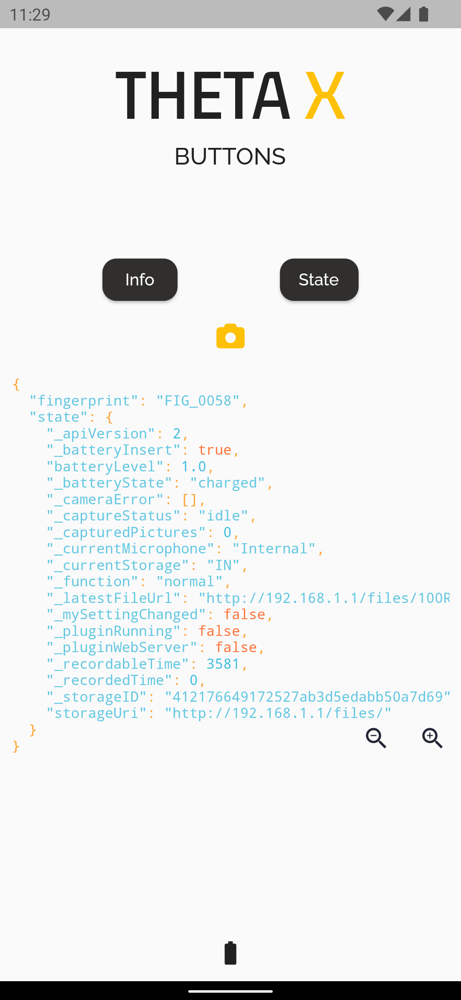
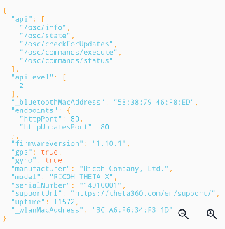
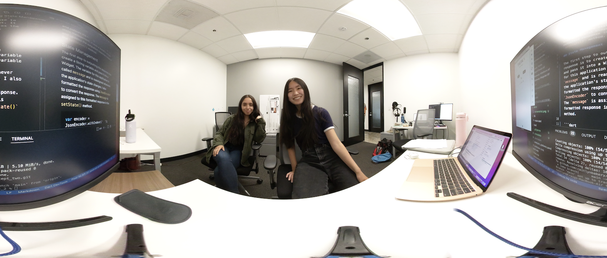

# Get Camera State and Update Mobile App



This application connects to a RICOH THETA X camera with the http package from Dart and outputs the response to the screen using state management. It uses a Stateful widget and updates the outputted response inside of the `setState()` method.  

## State Management and Data Serialization 

The first step to outputting the response is to create a String variable and pass it into a Widget. The variable for this application is called `message` and is reassigned whenever the application's state changes. The benefit of using state management in this application is to help make our app scalable for the future. Although the stateless approach in concept one worked, it becomes more confusing if we add more features to the application. In the future, we can make our app using Bloc state management.

I also formatted the response using `JsonEncoder` to convert the response. Data in Dart is held in a map that needs to be converted before we use it. Since the THETA X camera sends back a response in a JSON format, the application runs `jsonDecode` to convert it back into a Dart format. Once the response is in the Dart format, the application formats it with indentation. The `message` is assigned to this formatted response in the `setState()` method. 

```dart
var encoder = JsonEncoder.withIndent('  ');
var formattedResponse = encoder.convert(jsonDecode(response.body));
setState(() {
    message = formattedResponse;
});
```

## Syntax View

The application uses the [Flutter Syntax View](https://pub.dev/packages/flutter_syntax_view) package to display a certain theme. I used the `ayuLight` theme from the package.

```dart
child: SyntaxView(
code: message,
syntax: Syntax.DART,
syntaxTheme: SyntaxTheme.ayuLight(),
withLinesCount: false,
                )
```



## Taking Pictures 

This is a sample picture taken with the app. 


